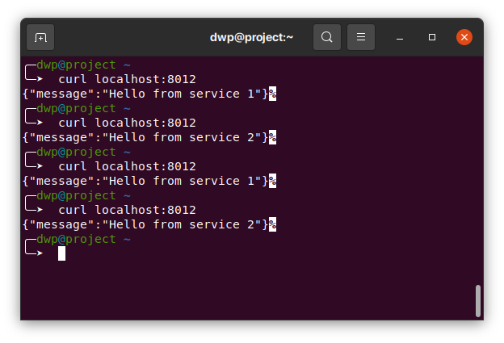

# Simple Nginx Loadbalance with Docker

# Getting Started
## Build docker image
* Build image proxy on directory `proxy`
```
docker build -t proxy:1.0 .
```
* Build image service on directory `service`
```
docker build -t service:1.0 .
```
* Create docker-network
```
docker network create simple-docker-lb-network;
```
## Run docker image
* Run service container
```
docker run --name service-1 -e SERVICE_ID=1 -e PORT=8001 --network simple-docker-lb-network -d service:0.1

docker run --name service-2 -e SERVICE_ID=2 -e PORT=8002 --network simple-docker-lb-network -d service:0.1
```
* Run proxy container
```
docker run --name proxy-1 -p 8012:80 --network simple-docker-lb-network -d proxy:0.1
```

## Testing loadbalance
Open new terminal and run command `curl localhost:8012` and you can see message from service like bellow:  


